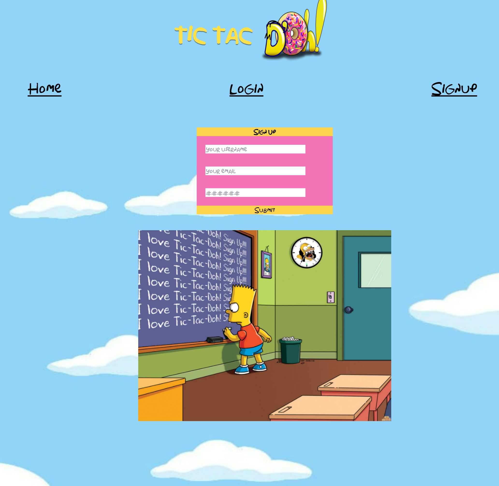
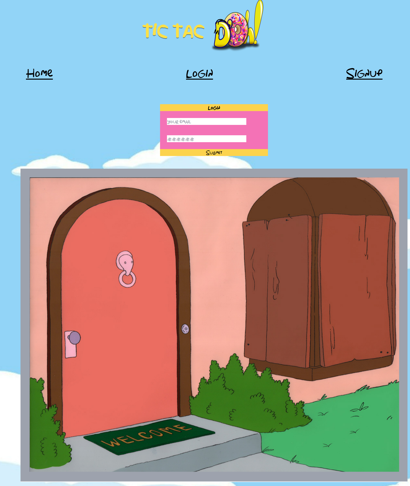
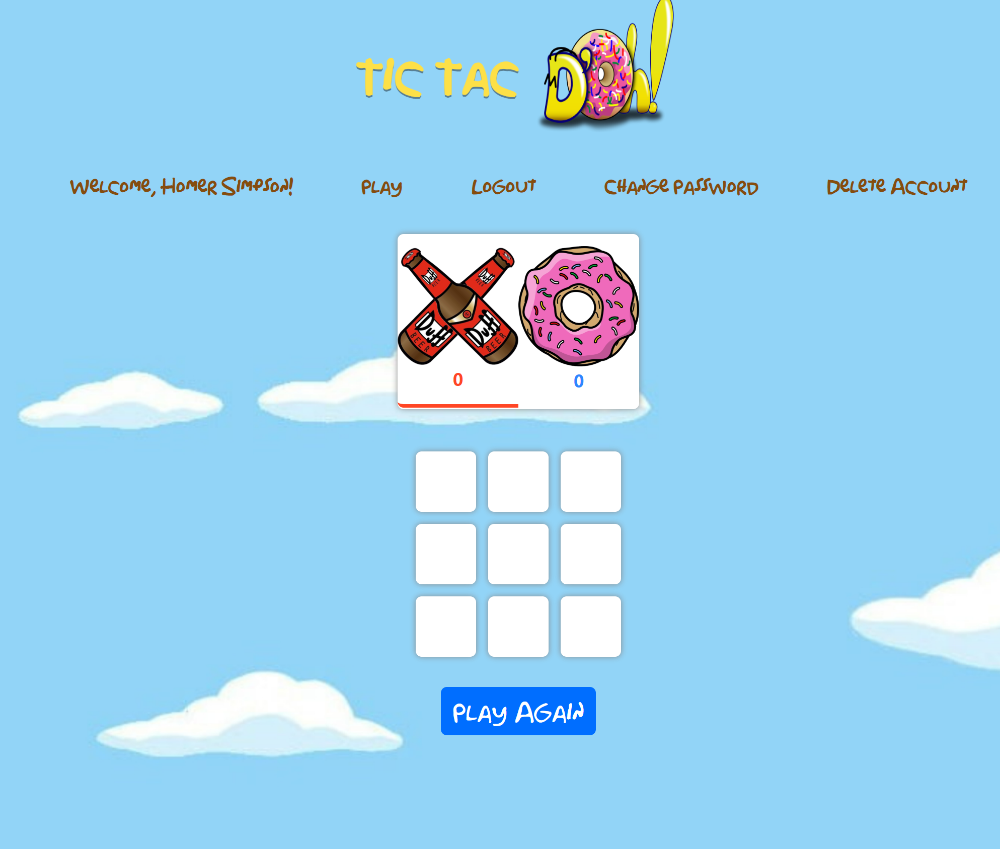

## Tic-Tac-Doh

'The Simpsons' Themed Tic-Tac-Toe Game!

## Table Of Contents

- [TableOfContents](#tableofcontents)
- [Description](#description)
- [Installation](#installation)
- [Usage](#usage)
- [Contributors](#contributors)
- [License](#license)

## Description

### Overview

Our final group project we created from scratch this Tic-Tac-Toe game themed with 'The Simpsons'. Using MERN-stack single-page application, MongoDB back end, a GraphQL API, and an Express.js and Node.js server with a React front end, implementing user authentication with JWT. This Multi-Player Tic-Tac-Toe game allows you to create a user ID, update passwords, delete your account and play our live Tic-Tac-DOH! game.

### Motivation

We created this project to play Tic-Tac-Toe with friends on a Simpsons themed page! As a group we went into the start of creating the project wanting to start and comple a robust app as well.

### What We Learned

As a group we learned more about integrating login technologies, creating responsive user interface, managing game logic, and a marco view of web development in general!

## Installation

Requires:
[Inquirer](https://www.npmjs.com/package/inquirer/v/8.2.4)
[Markdown](https://python-markdown.github.io/install/#:~:text=The%20easiest%20way%20to%20install%20Python-Markdown%20is%20simply,command%20from%20the%20command%20line%3A%20pip%20install%20markdown)
[JavaScript](https://nodejs.org/en)
[Mongoose](https://www.npmjs.com/package/mongoose)
[Tailwind](https://tailwindcss.com/docs/installation)
[Express](https://www.npmjs.com/package/express)
[GraphQL](https://graphql.org/graphql-js/)
[Apollo](https://www.npmjs.com/package/@apollo/server)
[Webtoken](https://www.npmjs.com/package/jsonwebtoken)
[React](https://react.dev/learn/start-a-new-react-project)
[Socket](https://socket.io/docs/v3/server-installation0)

## Usage

First, login or make an account

### Sign Up!

### Log In!

### Play the game!

## Contributors

[Athena Wallis](https://github.com/athenamw)
[Jesus Santos](https://github.com/MyComplex)
[Jason Gabianelli](https://github.com/JasonGabs)
[Ravneet Kaur](https://github.com/Neetk962)

## License

MIT License

Copyright (c) 2023 Athena Wallis, Jesus Santos, Jason Gabianelli, Ravneet Kaur
All rights reserved

### You are free:

to share – to copy, distribute and transmit the work
to remix – to adapt the work

### Under the following conditions:

attribution – You must give appropriate credit, provide a link to the license, and indicate if changes were made. You may do so in any reasonable manner, but not in any way that suggests the licensor endorses you or your use.
share alike – If you remix, transform, or build upon the material, you must distribute your contributions under the same or compatible license as the original.
npmnpm
inquirer
A collection of common interactive command line user interfaces.. Latest version: 9.2.11, last published: a month ago. Start using inquirer in your project by running npm i inquirer. There are 50024 other projects in the npm registry using inquirer.
nodejs.orgnodejs.org
Node.js
Node.js® is a JavaScript runtime built on Chrome's V8 JavaScript engine.
npmnpm
mongoose
Mongoose MongoDB ODM. Latest version: 7.6.3, last published: 14 hours ago. Start using mongoose in your project by running npm i mongoose. There are 14613 other projects in the npm registry using mongoose.
Tailwind CSSTailwind CSS
Installation - Tailwind CSS
The simplest and fastest way to get up and running with Tailwind CSS from scratch is with the Tailwind CLI tool. (422 kB)

Permission is hereby granted, free of charge, to any person obtaining a copy
of this software and associated documentation files (the "Software"), to deal
in the Software without restriction, including without limitation the rights
to use, copy, modify, merge, publish, distribute, sublicense, and/or sell
copies of the Software, and to permit persons to whom the Software is
furnished to do so, subject to the following conditions:

The above copyright notice and this permission notice shall be included in all
copies or substantial portions of the Software.
